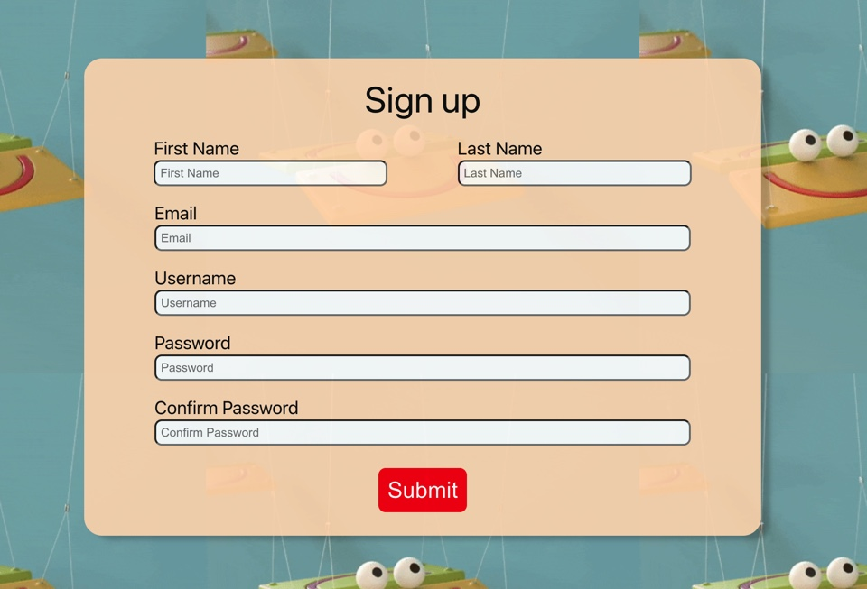
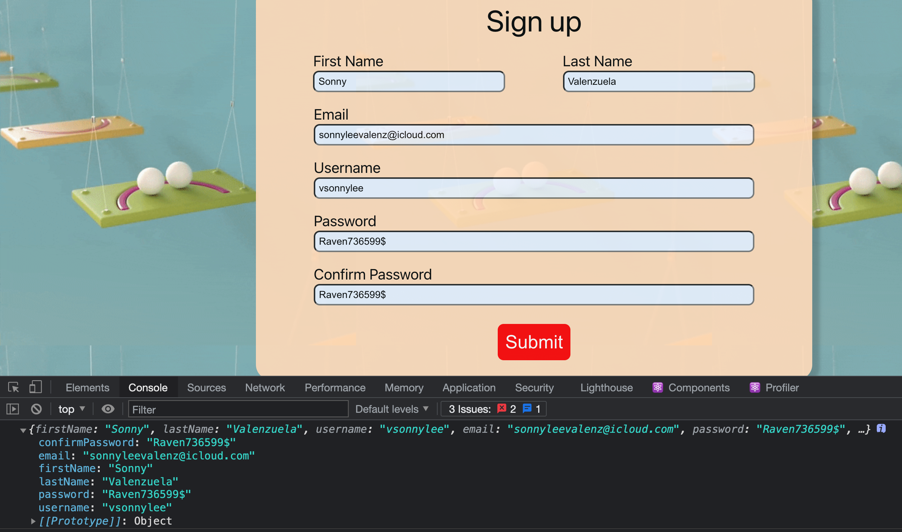
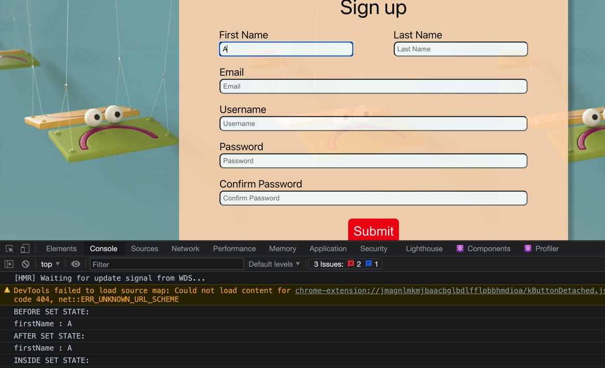

# `Auth Frontend Notes` 

> TERMINAL SETUP

> MKDIR FULLSTACK-AUTH

> NPX CREATE-REACT-APP AUTH-FRONTEND

> EXPRESS AUTH-BACKEND --VIEW=EJS

### `CD INTO FRONTEND`
* REMOVE UNWANTED REACT APPLICATIONS

### `RESET CSS FOR APPLICATION`
* CREATE FILE CALLED _BASE IN `SRC` 
* IMPORT `_BASE.CSS` ON TOP
* > import './_base.css'
* https://meyerweb.com/eric/tools/css/reset/
* COPY AND PASTE TEMPLATE CODE 

### `GETTING STARTED WITH FILE MANAGEMENT`
* CREATE `COMPONENTS` FOLDER IN SRC
* CREATE `SIGNUP.JS` AND `SIGNUP.CSS` IN COMPONENTS FOLDER
* COPY AND PASTE TEMPLATE CODE INTO `SIGNUP.CSS`

### `BUILD SIGNUP SKELETON`
* TYPE `RCE INTO SIGNUP` 
* GIVE DIV A CLASS_NAME='CONTAINER'
* SETUP SIGN_UP PAGE

```JAVASCRIPT
import Signup from './components/Signup/Signup'

function App() {
  return (
    <div>
      <Signup/>
    </div>
  )
}

export default App
```
* SIGNUP PAGE SHOULD BE BLANK AND READY FOR HTML

============= BUILD FRAME FOR FORM
* SETUP DIV AND FORMS
* SET STATE
* RENDER STATE
* ADD VALUE AND PLACEHOLDER

```JAVASCRIPT
import React, { Component } from "react";
import "./Signup.css";

export class Signup extends Component {
  state = {
    firstName: "",
    lastName: "",
    username: "",
    email: "",
    password: "",
    confirmPassword: "",
  };
  render() {
    const { firstName, lastName, username, email, password, confirmPassword } = this.state;
    
    return (
      <div className="container">
        <div className="form-text">Sign up</div>
        <div className="form-div">
          <form className="form">
            <div className="form-group-inline">
              <div className="inline-container">
                <label htmlFor="firstName">First Name</label>
                <input
                  type="text"
                  id="firstName"
                  value={firstName}
                  placeholder="First Name"
                />
              </div>
              <div className="inline-container">
                <label htmlFor="lastName">Last Name</label>
                <input
                  type="text"
                  id="lastName"
                  value={lastName}
                  placeholder="Last Name"
                />
              </div>
            </div>
            <div className="form-group-block">
              <div className="block-container">
                <label htmlFor="email">Email</label>
                <input
                  type="text"
                  id="email"
                  value={email}
                  placeholder="Email"
                />
              </div>
            </div>
            <div className="form-group-block">
              <div className="block-container">
                <label htmlFor="username">Username</label>
                <input
                  type="text"
                  id="username"
                  value={username}
                  placeholder="Username"
                />
              </div>
            </div>
            <div className="form-group-block">
              <div className="block-container">
                <label htmlFor="password">Password</label>
                <input
                  type="text"
                  id="password"
                  value={password}
                  placeholder="Password"
                />
              </div>
            </div>
            <div className="form-group-block">
              <div className="block-container">
                <label htmlFor="confirmPassword">Confirm Password</label>
                <input
                  type="text"
                  id="confirmPassword"
                  value={confirmPassword}
                  placeholder="Confirm Password"
                />
              </div>
            </div>
            <div className="button-container">
              <button>Submit</button>
            </div>
          </form>
        </div>
      </div>
    );
  }
}
export default Signup;
```

* EXAMPLE OF CURRENT STATE WITH CURRENT CSS

======== NEXT STEP SETUP CREATE HANDLE ON SUBMIT AND ON CHANGE 
* CREATE HANDLE ON SUBMIT FUNCTION
* CREATE HANDLE ON CHANGE FUNCTION
* PROBLEM IS A LOT OF REPEATED CODE
* BEFORE REFACTOR

```JAVASCRIPT
import React, { Component } from "react";
import "./Signup.css";
export class Signup extends Component {
  state = {
    firstName: "",
    lastName: "",
    username: "",
    email: "",
    password: "",
    confirmPassword: "",
  };
  handleFirstNameOnChange = (event) => {
    this.setState({
      firstName: event.target.value,
    });
  };
  handleLastNameOnChange = (event) => {
    this.setState({
      lastName: event.target.value,
    });
  };
  handleEmailOnChange = (event) => {
    this.setState({
      email: event.target.value,
    });
  };
  handleUsernameOnChange = (event) => {
    this.setState({
      username: event.target.value,
    });
  };
  handlePasswordOnChange = (event) => {
    this.setState({
      password: event.target.value,
    });
  };
  handleConfirmPasswordOnChange = (event) => {
    this.setState({
      confirmPassword: event.target.value,
    });
  };
  handleOnSubmit = (event) => {
    event.preventDefault();
    console.log(this.state);
  };
  render() {
    const { firstName, lastName, username, email, password, confirmPassword } =
      this.state;
    return (
      <div className="container">
        <div className="form-text">Sign up</div>
        <div className="form-div">
          <form className="form" onSubmit={this.handleOnSubmit}>
            <div className="form-group-inline">
              <div className="inline-container">
                <label htmlFor="firstName">First Name</label>
                <input
                  type="text"
                  id="firstName"
                  value={firstName}
                  placeholder="First Name"
                  onChange={this.handleFirstNameOnChange}
                />
              </div>
              <div className="inline-container">
                <label htmlFor="lastName">Last Name</label>
                <input
                  type="text"
                  id="lastName"
                  value={lastName}
                  placeholder="Last Name"
                  onChange={this.handleLastNameOnChange}
                />
              </div>
            </div>
            <div className="form-group-block">
              <div className="block-container">
                <label htmlFor="email">Email</label>
                <input
                  type="text"
                  id="email"
                  value={email}
                  placeholder="Email"
                  onChange={this.handleEmailOnChange}
                />
              </div>
            </div>
            <div className="form-group-block">
              <div className="block-container">
                <label htmlFor="username">Username</label>
                <input
                  type="text"
                  id="username"
                  value={username}
                  placeholder="Username"
                  onChange={this.handleUsernameOnChange}
                />
              </div>
            </div>
            <div className="form-group-block">
              <div className="block-container">
                <label htmlFor="password">Password</label>
                <input
                  type="text"
                  id="password"
                  value={password}
                  placeholder="Password"
                  onChange={this.handlePasswordOnChange}
                />
              </div>
            </div>
            <div className="form-group-block">
              <div className="block-container">
                <label htmlFor="confirmPassword">Confirm Password</label>
                <input
                  type="text"
                  id="confirmPassword"
                  value={confirmPassword}
                  placeholder="Confirm Password"
                  onChange={this.handleConfirmPasswordOnChange}
                />
              </div>
            </div>
            <div className="button-container">
              <button>Submit</button>
            </div>
          </form>
        </div>
      </div>
    );
  }
}
export default Signup;
```

======= REFACTOR REPEATED CODE



* CAPTURES INPUT 

```javascript
import React, { Component } from "react";
import "./Signup.css";

export class Signup extends Component {
  state = {
    firstName: "",
    lastName: "",
    username: "",
    email: "",
    password: "",
    confirmPassword: "",
  };
  handleOnChange = (event) => {
    console.log(event.target.name, ":", event.target.value);
    this.setState({
      [event.target.name]: event.target.value,
    });
  };

  handleOnSubmit = (event) => {
    event.preventDefault();
    console.log(this.state);
  };

  render() {
    const { firstName, lastName, username, email, password, confirmPassword } =
      this.state;
    return (
      <div className="container">
        <div className="form-text">Sign up</div>
        <div className="form-div">
          <form className="form" onSubmit={this.handleOnSubmit}>
            <div className="form-group-inline">
              <div className="inline-container">
                <label htmlFor="firstName">First Name</label>
                <input
                  type="text"
                  id="firstName"
                  value={firstName}
                  placeholder="First Name"
                  name="firstName"
                  onChange={this.handleOnChange}
                />
              </div>
              <div className="inline-container">
                <label htmlFor="lastName">Last Name</label>
                <input
                  type="text"
                  id="lastName"
                  value={lastName}
                  placeholder="Last Name"
                  name="lastName"
                  onChange={this.handleOnChange}
                />
              </div>
            </div>
            <div className="form-group-block">
              <div className="block-container">
                <label htmlFor="email">Email</label>
                <input
                  type="text"
                  id="email"
                  value={email}
                  placeholder="Email"
                  name="email"
                  onChange={this.handleOnChange}
                />
              </div>
            </div>
            <div className="form-group-block">
              <div className="block-container">
                <label htmlFor="username">Username</label>
                <input
                  type="text"
                  id="username"
                  value={username}
                  placeholder="Username"
                  name="username"
                  onChange={this.handleOnChange}
                />
              </div>
            </div>
            <div className="form-group-block">
              <div className="block-container">
                <label htmlFor="password">Password</label>
                <input
                  type="text"
                  id="password"
                  value={password}
                  placeholder="Password"
                  name="password"
                  onChange={this.handleOnChange}
                />
              </div>
            </div>
            <div className="form-group-block">
              <div className="block-container">
                <label htmlFor="confirmPassword">Confirm Password</label>
                <input
                  type="text"
                  id="confirmPassword"
                  value={confirmPassword}
                  placeholder="Confirm Password"
                  name="confirmPassword"
                  onChange={this.handleOnChange}
                />
              </div>
            </div>
            <div className="button-container">
              <button>Submit</button>
            </div>
          </form>
        </div>
      </div>
    );
  }
}
export default Signup;
```
* IMPORTANT TO NOTE SET STATE IS ASYNC 

```JAVASCRIPT
  handleOnChange = (event) => {
    //RUNS FIRST 
    console.log('BEFORE SET STATE: ');
    console.log(event.target.name, ":", event.target.value);
    this.setState({
      [event.target.name]: event.target.value,
    }, () => {
        //RUNS LAST 3
        console.log('INSIDE SET STATE: ');
        console.log(event.target.name, ":", event.target.value)
    });
    // RUNS SECOND 2
    console.log('AFTER SET STATE: ');
    console.log(event.target.name, ":", event.target.value);
  };
```
